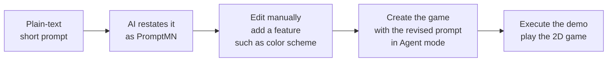

# PromptMN

> A pseudo-prompting language (DSL) that gives AI **typed, semantic directives** for
> interpreting and executing prompts.

[](https://arxiv.org/abs/2606.17164)
[](LICENSE)
[](CHANGELOG.md)

## What is PromptMN?

Prompting is how we talk to AI — yet in plain prose the parts that matter most (the
role, the goal, the constraints, the expected output) often sit buried or unsaid. In
agentic and software workflows, a single misread at the first handoff can ripple
through every step that follows.

PromptMN makes intent explicit. It annotates natural language with compact,
`%`-prefixed **typed directives** for roles, goals, requirements, priorities,
constraints, plans, inputs, and outputs. You write in any order you like, and the
interpreter resolves each directive by meaning before acting.

The result sits comfortably between free-form prompting and pseudocode — structured
enough to inspect, reuse, and review, yet light enough for analysts, managers,
developers, and stakeholders alike. Often a handful of keywords is all it takes to
express a complete, unambiguous prompt.

Read the paper: **[PromptMN: Pseudo Prompting Language (arXiv:2606.17164)](https://arxiv.org/abs/2606.17164)**

## A first taste

```promptmn
%role friendly assistant;
%goal greet the world;
%repeat <3 times>
    %out: Hello Human–AI World!;
```

## See it in action

### 1. Hello, World!

The smallest possible PromptMN program — a goal and an output — interpreted and run.

https://github.com/user-attachments/assets/0aab401d-a685-4c24-93d9-e47d1e9d736b

### 2. Check a prime number

A real method with a condition and a loop, resolved correctly by the model and
returning a result.

```promptmn
%method %is-prime(%n) {
    %if <%n less than 2>
        { %return false; }
    %var %counter = 2;
    %repeat <%counter is at most half of %n> {
        %if <%counter divides %n evenly>
            { %return false; }
        %counter = %counter + 1;
    }
    %return true;
}
%var %number = 23;
%out %is-prime(%number);
```

https://github.com/user-attachments/assets/c44df244-1945-441f-86cc-1ac96f82624a

### 3. Reverse prompt engineering — a Penguin 2D demo

PromptMN pairs naturally with reverse prompt engineering: start with a short plain-text
prompt, ask an AI model to restate it as PromptMN, manually revise the generated prompt
by adding a feature such as a color scheme, then use the revised prompt in Agent mode to
create and run the game demo.




https://github.com/user-attachments/assets/ee24ad7b-c744-4b70-90a3-f45946a2bfca


## Documentation

- [Language specification](docs/specification.md) — the full reference.
- [Concise reference](docs/specification-concise.md) — every keyword at a glance.

## What's next

More examples, showcases, and visuals are on the way — including a side-by-side of a
plain-text prompt versus the same intent written in PromptMN, showing how a few
keywords can carry a complete, effective prompt.

## Contributing

Contributions are warmly welcome. Try the language, share an example, sharpen the
docs, or open an issue or pull request — every bit helps PromptMN grow.

## Contact

Enkhzol Dovdon — [dovdon.enkhzol@outlook.com](mailto:dovdon.enkhzol@outlook.com)

## License

[MIT](LICENSE) © 2026 Enkhzol Dovdon
