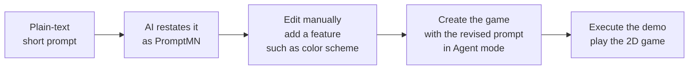

# PromptMN

> A pseudo-prompting language (DSL) that gives AI **typed, semantic directives** for
> interpreting and executing prompts.

[](https://arxiv.org/abs/2606.17164)
[](LICENSE)
[](CHANGELOG.md)

## What is PromptMN?

Prompting is how we talk to AI, but long plain text often buries key intent such as
role, goal, constraints, and expected output. In agentic and software workflows, a
single misread at the first handoff can cascade through design, development,
review, and deployment.

PromptMN is a pseudo-prompting language that provides typed directives, control
flow, and structured blocks for writing clear, unambiguous AI prompts with semantic
execution. It annotates natural language with compact, `%`-prefixed **typed directives**
for roles, goals, requirements, priorities, constraints, plans, inputs, and outputs,
and supports control structures like `%if`, `%else`, `%repeat`, `%method`, and
data declarations to express logic and structure. It is built for cases where logic
and semantics are nested and deep, where natural language becomes a chain of "if
this, then that," and where classical structures such as XML, JSON, or template-style
prompts impose heavy syntax yet lack semantic clarity in Human-to-GenAI interaction.

Instead of manually tracking every condition, dependency, and logical flow,
PromptMN lets you write in any order while the interpreter resolves each directive
by meaning before acting. That makes prompts easier to inspect, reuse, and review
while keeping them light enough for analysts, managers, developers, and stakeholders.
A few keywords can express a complete, unambiguous prompt across the software
development lifecycle, which boosts productivity and reduces repeated interactions
with Generative AI.

Read the paper: **[PromptMN: Pseudo Prompting Language (arXiv:2606.17164)](https://arxiv.org/abs/2606.17164)**

## Get Started

```PromptMN
%repeat <3 times>
    %out: Hello Human–AI World!;
```

## See it in action

### 1. Hello, World!

The smallest possible PromptMN program — a goal and an output — interpreted and run.

https://github.com/user-attachments/assets/0aab401d-a685-4c24-93d9-e47d1e9d736b

### 2. Check a prime number

A real method with a condition and a loop, resolved correctly by the model and
returning a result.

```PromptMN
%method %is-prime(%n) {
    %if <%n less than 2>
        { %return false; }
    %var %counter = 2;
    %repeat <%counter is at most half of %n> {
        %if <%counter divides %n evenly>
            { %return false; }
        %counter = %counter + 1;
    }
    %return true;
}
%var %number = 23;
%out %is-prime(%number);
```

https://github.com/user-attachments/assets/c44df244-1945-441f-86cc-1ac96f82624a

### 3. Reverse prompt engineering — a Penguin 2D demo

PromptMN pairs naturally with reverse prompt engineering: start with a short plain-text
prompt, ask an AI model to restate it as PromptMN, manually revise the generated prompt
by adding a feature such as a color scheme, then use the revised prompt in Agent mode to
create and run the game demo.



https://github.com/user-attachments/assets/ee24ad7b-c744-4b70-90a3-f45946a2bfca


## PromptMN — Nested/Complex Prompt Template

### A nested, complex prompt template for inspiration.

```
%role senior software engineer;
%domain {health care; UX; data science;}
%in {uploaded time-series dataset; visualized image for inspiration;}
%goal create a dashboard that …;
%intro {in a previous benchmark with another client, …}
%aware {the existing architecture rules in …/…/ directory, …}
%newreq {create a new feature that has the following workflow:
  %1 …;
  %2 … . %aware {…;
            %if <…> {…; …;}
            %else {%goto %jumplabel-1;} …;
         }
  %3 {…;
    %problem … the current approach in …;
    %update {…; …;}
    %could {…;}
    %mustnot …;
  }
  %4 {%reqfunc {…; …;} %jumplabel-1 …;}
  %rule {…; …;}
}
…
%techs React; TypeScript; Tailwind; Next.js; PostgreSQL; Kubernetes;
%optional pgvector; Zod; Visx;
%data …;
%newreq {…; %method %visualize-occurrence(%dataset) {%out …;}}
…
%risk {SQL injection; prompt injection; profanity free; …;}
%showplan
```

## Documentation

- [Language specification](PromptMN/PromptMN-specification.txt) — the full reference.
- [Concise reference](PromptMN/PromptMN-specification-concise.txt) — every keyword at a glance.

## What's next

More examples, demos, and visuals are coming soon to show how a few keywords can
capture complete, effective prompts for real workflows and support accurate production.

## Contributing

Contributions are warmly welcome. Try the language, share examples, improve the docs, or
open an issue or pull request, and every contribution helps PromptMN grow.

## Contact

Enkhzol Dovdon: [dovdon.enkhzol@outlook.com](mailto:dovdon.enkhzol@outlook.com)

## License

[MIT](LICENSE) © 2026 Enkhzol Dovdon
